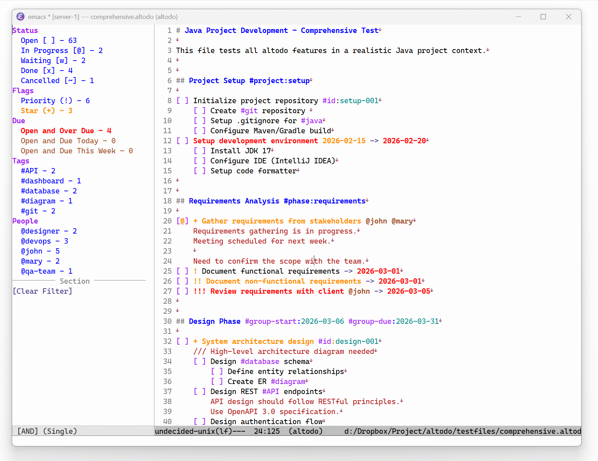

# altodo - TODO Text File Format and Emacs Major Mode Package



This repository distributes the __altodo__ format specification and __altodo.el__, an Emacs Major Mode package for convenient TODO management.

- __altodo__ format: TODO format embeddable in Markdown (CommonMark) files
    - altodo format extensions are MIT licensed
- __altodo.el__: Emacs Lisp package for managing altodo format TODOs in Emacs
    - GNU General Public License v3.0 applies


## About altodo Format

__altodo__ is a custom extension of __Markdown__ and __CommonMark__ format specifications. altodo is based on and inspired by __[x]it!__ https://xit.jotaen.net/, which is licensed under Creative Commons CC0 1.0 Universal.

See doc/altodo_spec.md for details.

- Text format specification as custom extension of Markdown (CommonMark)
    - altodo format follows Markdown (CommonMark) specification except for altodo-specific syntax
- TODOs can be nested infinitely
- Single-line and multi-line comments supported
- Tags, stars, priority, start/due dates, and dependency tags supported

Key features: TODOs can be embedded in Markdown, plain text format, infinite nesting, and multi-line comments. The format is simple and understandable even without editor support.


### Sample

```markdown
# altodo is a TODO format embeddable in Markdown

Regular Markdown (CommonMark) text can be placed before and after task lines.

[ ] TODO line starts here
[ ] Inline Markdown formatting like __bold__ ~~strikethrough~~ `code` works in tasks
[x] TODO line ends here

Non-task and non-comment lines are regular Markdown (CommonMark).


# Tags can be embedded in headings too #tag

## altodo File Example #tag

Below is an example of altodo format tasks.

[@] In-progress task
    /// Single-line comment
    [ ] Child task A (nest indent typically 4 spaces)
        [x] Completed child task
            [~] Cancelled task
    [w] Waiting task @JohnDoe is handling
[ ] + Starred task
    [ ] ! High priority task
        [ ] !! Higher priority task
            [ ] !!! Highest priority task
[ ] Task
    Multi-line comment line 1
    Multi-line comment line 2
    [ ] Nested task A
        Nested task A multi-line comment line 1
        Nested task A multi-line comment line 2
        
        Blank line 3 is part of comment if indented (comment line 4)
[ ] Tagged task #home (space required before/after tag)
[ ] Task with start date 2025-01-01 -> starts from this date
    [ ] Task with due date -> 2025-12-31 must complete by this date
    [ ] Task with both dates 2025-02-01 -> 2025-03-31 within this period
[ ] Key-value tagged task #key:value
[ ] Task with ID tag (unique identifier) #id:20250101-0000
[ ] Task with dependency tag (references ID) #dep:20250101-0000
[ ] Dependent task 2 (references ID) #dep:20250101-0000
[ ] People @JohnDoe or places @home can be tagged with @person tags
```

### Main Syntax

#### Task Management

- `[ ]`: Open
- `[x]`: Done (auto-adds #done tag)
- `[@]`: In Progress
- `[w]`: Waiting
- `[~]`: Cancelled


#### Comments

- `/// comment`: Single-line comment
- Task/comment indent + 4 spaces: Multi-line comment


#### Flags

- `!`, `!!`, `!!!`: Priority (typically 3 levels, more `!` = higher priority)
- `+`: Star flag


#### Tags

- `#tag`: General tag
- `#tag:value`: Key-value tag
- `@person`: Person/place tag (e.g., `@smith`, `@company`)

Special tags with functionality:

- `#id:value`: ID tag
- `#dep:value`: Dependency tag (references ID tag value)


#### Due/Start Dates

- `-> YYYY-MM-DD`: Due date
- `YYYY-MM-DD ->`: Start date
- `YYYY-MM-DD -> YYYY-MM-DD`: Start and due date


## altodo.el

Emacs Lisp package for managing altodo format TODOs in Emacs. Custom extension of __Emacs Markdown Mode__ https://github.com/jrblevin/markdown-mode, providing face highlighting, filtering, and other features for easy task viewing and manipulation.

See doc/design.md for details.

- Convenient face highlighting, keybindings, and commands for altodo file management
- Sidebar with dynamic filter matching and count display
    - Sidebar content is fully customizable

Key features: Tested for managing thousands of TODOs flexibly and quickly, Emacs-friendly with comfortable and fast operation, flexible sidebar customization. Provides DSL for filtering and rich predicate functions.


### Keybindings

altodo-mode inherits from markdown-mode, so markdown-mode keybindings are also available. For altodo-specific lines (task lines, multi-line comments), altodo keybindings apply; otherwise markdown-mode keybindings apply.


#### Task Operations

- `C-c C-x`: Toggle task state (open `[ ]` ⇔ done `[x]`)
- `C-c C-t o`: Set to open
- `C-c C-t x`: Set to done
- `C-c C-t @`: Set to in-progress
- `C-c C-t w`: Set to waiting
- `C-c C-t ~`: Set to cancelled


#### Flag Operations

- `C-c C-s`: Toggle star flag
- `C-c C-f 1`: Set priority 1
- `C-c C-f 2`: Set priority 2
- `C-c C-f 3`: Set priority 3
- `C-c C-i`: Insert ID tag (`#id:value` format)


#### Indent (Nesting) Operations

- `TAB`: Smart indent
- `M-<right>`: Increase indent
- `M-<left>`: Decrease indent


#### Other

- `S-TAB`: Outline cycle
- `C-c C-t d`: Move done task to done file
- `C-c C-j`: Jump to dependency (`#dep:xxx` → `#id:xxx`)
- `M-x altodo-sidebar-show`: Show sidebar
- `M-x altodo-sidebar-hide`: Hide sidebar
- `M-x altodo-sidebar-toggle`: Toggle sidebar

#### Sidebar Operations (within sidebar)

- `C-SPC`: Select/deselect filter
- `C-c C-a`: Switch to AND mode
- `C-c C-o`: Switch to OR mode
- `C-c C-t`: Toggle AND/OR
- `Ctrl+mouse-left`: Select/deselect filter with mouse


### Done Task Move Feature

Automatically move completed (`[x]`) or cancelled (`[~]`) tasks to separate file. Current version maintains heading structure but moves task lines as-is without preserving nesting.


#### Basic Features

- Manual move: `C-c C-t d` moves task at cursor
- Batch move: `M-x altodo-move-all-done-tasks` moves all done tasks in buffer
- Auto-move timer: Periodically moves done tasks from all buffers


#### Done File

- Done tasks move to `{original-filename}_done.altodo`
- Grouped by heading (section)
- Multi-line comments move with task
- Blank lines preserved


#### Auto-move Timer

```elisp
;; Toggle timer start/stop
M-x altodo-toggle-auto-move-timer

;; Or individually
M-x altodo-start-auto-move-timer
M-x altodo-stop-auto-move-timer

;; Change execution interval (default: 3600 seconds = 1 hour)
(setq altodo-auto-move-interval 1800)  ; 30 minutes

;; Enable auto-save after move (default: nil)
(setq altodo-auto-save-after-move t)

;; Skip done files (default: t)
(setq altodo-auto-move-skip-done-files t)

;; Show in mode line (default: t)
(setq altodo-show-auto-move-in-mode-line t)
```


#### Done File Customization

```elisp
;; Change done file suffix (default: "_done")
(setq altodo-done-file-prefix "_archive")
```


### Configuration

#### Basic Settings

| Variable | Description | Default |
|----------|-------------|---------|
| `altodo-indent-size` | Indent size (spaces) | `4` |
| `altodo-enable-markdown-in-multiline-comments` | Enable Markdown formatting in multi-line comments | `t` |
| `altodo-auto-save` | Auto-save file on task state change | `nil` |
| `altodo-skk-wrap-newline` | Wrap newline for SKK input method compatibility | `t` |


#### Sidebar Settings

| Variable | Description | Default |
|----------|-------------|---------|
| `altodo-sidebar-modeline-enabled` | Show filter state in sidebar mode line | `t` |
| `altodo-sidebar-dynamic-count-enabled` | Dynamically update count with multiple filters | `t` |
| `altodo-sidebar-buffer-name` | Sidebar buffer name | `"*altodo-filters*"` |
| `altodo-sidebar-position` | Sidebar position (`left` or `right`) | `'left` |
| `altodo-sidebar-size` | Sidebar width (window ratio 0.0-1.0) | `0.2` |
| `altodo-sidebar-indent` | Sidebar indent width | `2` |
| `altodo-sidebar-focus-after-activation` | Focus sidebar after activation | `nil` |
| `altodo-sidebar-auto-resize` | Auto-resize sidebar | `nil` |
| `altodo-sidebar-hide-mode-line` | Hide sidebar mode line | `nil` |
| `altodo-sidebar-hide-line-numbers` | Hide sidebar line numbers | `t` |


#### Date/ID Settings

| Variable | Description | Default |
|----------|-------------|---------|
| `altodo-date-format` | Date format (nil for ISO 8601) | `nil` |
| `altodo-week-start-day` | Week start day (1=Monday, 0=Sunday) | `1` |
| `altodo-done-tag-datetime-format` | #done tag timestamp format | `nil` |
| `altodo-use-local-timezone` | Use local timezone in #done tag | `t` |
| `altodo-insert-id-format` | #id: tag ID format | `'tiny-random` |


##### `altodo-date-format`

Date display format. `nil` uses ISO 8601 format (`YYYY-MM-DD`).

**Examples**:
```elisp
(setq altodo-date-format "%Y/%m/%d")      ;; 2026/01/15
(setq altodo-date-format "%Y-%m-%d")      ;; 2026-01-15
(setq altodo-date-format nil)             ;; 2026-01-15 (ISO 8601)
```

##### `altodo-done-tag-datetime-format`

`#done:TIMESTAMP` tag timestamp format. `nil` uses ISO 8601 format (`YYYY-MM-DDTHH:MM:SS+HH:MM`).

**Examples**:
```elisp
(setq altodo-done-tag-datetime-format "%Y-%m-%d %H:%M:%S")  ;; 2026-01-15 14:30:00
(setq altodo-done-tag-datetime-format nil)                  ;; 2026-01-15T14:30:00+09:00
```

##### `altodo-insert-id-format`

ID tag format for `C-c C-i` insertion.

**Options**:
- `'tiny-random`: Random 8 characters (default)
- `'tiny-sortable`: Timestamp-based 8 characters (sortable)
- `'short-random`: Random 16 characters
- `'short-sortable`: Timestamp-based 16 characters
- `'uuidv7`: UUID v7 format

**Examples**:
```elisp
(setq altodo-insert-id-format 'tiny-random)      ;; a1b2c3d4
(setq altodo-insert-id-format 'tiny-sortable)    ;; 20260115a1b2
(setq altodo-insert-id-format 'uuidv7)           ;; 7d444840-9dc0-11d1-b245-5ffdce74fad2
```


#### Task Move Settings

| Variable | Description | Default |
|----------|-------------|---------|
| `altodo-done-file-prefix` | Done file prefix | `"_done"` |
| `altodo-move-single-line-comments-manually` | Enable manual single-line comment move | `t` |
| `altodo-auto-move-interval` | Auto-move execution interval (seconds) | `3600` |
| `altodo-auto-save-after-move` | Auto-save after move | `nil` |
| `altodo-auto-move-skip-done-files` | Skip done files | `t` |
| `altodo-show-auto-move-in-mode-line` | Show auto-move state in mode line | `t` |


#### Debug Settings

| Variable | Description | Default |
|----------|-------------|---------|
| `altodo-debug-mode` | Enable debug mode | `nil` |
| `altodo-font-lock-maximum-decoration` | Maximize font-lock decoration | `t` |
| `altodo-debug-log-file` | Debug log file path | `nil` |
| `altodo-debug-log-to-messages` | Output debug log to *Messages* buffer | `nil` |


#### Default Filter Settings

| Variable | Description | Default |
|----------|-------------|---------|
| `altodo-default-filter-patterns` | Default sidebar filter patterns | See below |

```elisp
;; Default filter configuration example
(setq altodo-default-filter-patterns
  '((:title "Status" :type group-header :nest 0)
    (:title "Open [ ] - %n" :type search-simple :pattern "open" :count-format t :nest 1)
    (:title "In Progress [@] - %n" :type search-simple :pattern "progress" :count-format t :nest 1)
    (:title "Waiting [w] - %n" :type search-simple :pattern "waiting" :count-format t :nest 1)
    (:title "Done [x] - %n" :type search-simple :pattern "done" :count-format t :nest 1)
    (:title "Cancelled [~] - %n" :type search-simple :pattern "cancelled" :count-format t :nest 1)
    (:title "Flags" :type group-header :nest 0)
    (:title "Priority (!) - %n" :type search-simple :pattern "priority" :count-format t :nest 1)
    (:title "Star (+) - %n" :type search-simple :pattern "star" :count-format t :nest 1)
    (:title "Due" :type group-header :nest 0)
    (:title "Open and Over Due - %n"
            :type search-lambda
            :pattern (lambda ()
                       (and (altodo--due-date-matches-p 'overdue)
                            (not (or (altodo--line-state-p altodo-state-done)
                                     (altodo--line-state-p altodo-state-cancelled)))))
            :count-format t :nest 1
            :face-rules ((>= 1 error)))
    (:title "Open and Due Today - %n"
            :type search-lambda
            :pattern (lambda ()
                       (and (altodo--due-date-matches-p 'today)
                            (not (or (altodo--line-state-p altodo-state-done)
                                     (altodo--line-state-p altodo-state-cancelled)))))
            :count-format t :nest 1
            :face-rules ((>= 1 error)))
    (:title "Open and Due This Week - %n"
            :type search-lambda
            :pattern (lambda ()
                       (and (altodo--due-date-matches-p 'this-week)
                            (not (altodo--due-date-matches-p 'today))
                            (not (or (altodo--line-state-p altodo-state-done)
                                     (altodo--line-state-p altodo-state-cancelled)))))
            :count-format t :nest 1)
    (:title "Tags" :type group-header :nest 0)
    (:title "#%s - %n" :type dynamic :dynamic-type "tag" :count-format t :limit 5 :nest 1
            :exclude-tag ("id" "dep" "done") :tag-mode "name-only")
    (:title "People" :type group-header :nest 0)
    (:title "@%s - %n" :type dynamic :dynamic-type "person" :count-format t :limit 5 :nest 1)
    (:title "Section" :type separator :pattern "─" :nest 0)
    (:title "[Clear Filter]" :type command :nest 0 :command altodo-filter-clear)))
```


#### Configuration Examples

```elisp
;; Timezone setting
(setq altodo-use-local-timezone t)

;; Date format setting
(setq altodo-date-format "%Y/%m/%d")

;; #done tag format setting
(setq altodo-done-tag-datetime-format nil)

;; Enable Markdown in multi-line comments
(setq altodo-enable-markdown-in-multiline-comments t)

;; Indent size setting
(setq altodo-indent-size 4)

;; Show sidebar on right
(setq altodo-sidebar-position 'right)

;; Auto-move every 30 minutes
(setq altodo-auto-move-interval 1800)

;; Auto-save after move
(setq altodo-auto-save-after-move t)
```


### Installation

- Emacs 27.1 or later
- markdown-mode installed
    - altodo.el is tested and developed with the version available at release time


Place altodo.el in a suitable directory and add to init.el:

```
cp ./altodo.el ~/.emacs.d/lisp/.
```

```elisp
(add-to-list 'load-path "~/.emacs.d/lisp/")
(require 'altodo)
(add-to-list 'auto-mode-alist '("\\.altodo\\'" . altodo-mode))
```

#### Getting Started

1. Create or open a `.altodo` file
2. Enable altodo-mode with `M-x altodo-mode`
3. Show sidebar with `M-x altodo-sidebar-show`
4. Manage tasks with keybindings
